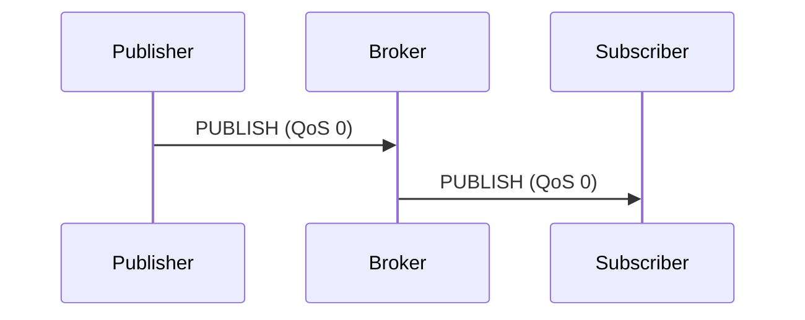
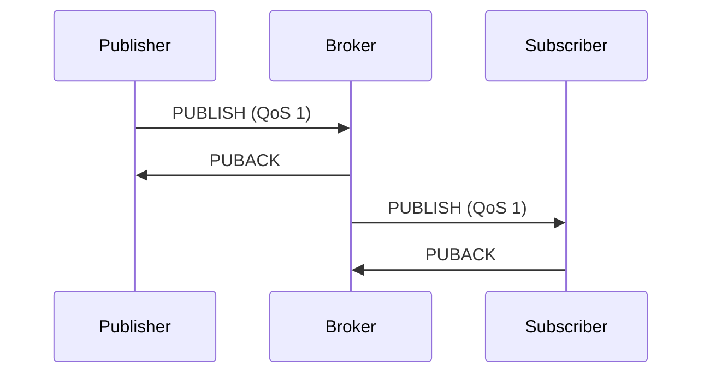
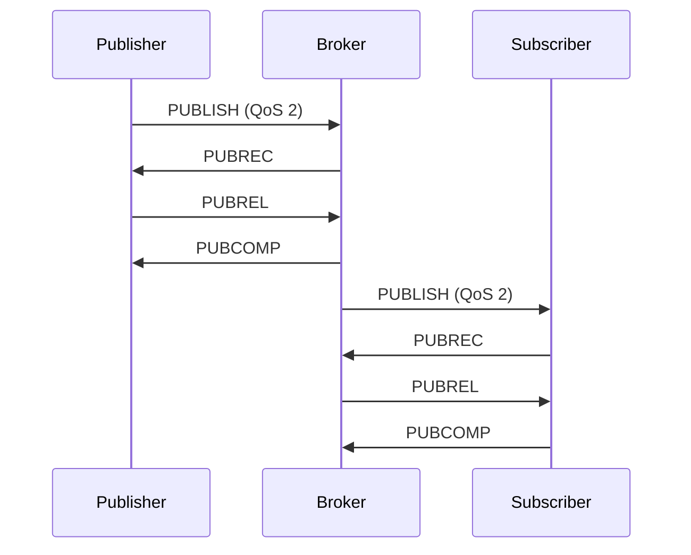

## Overview

Quality of Service (QoS) in MQTT defines the guarantee of message delivery between clients and the broker. MQTT provides three QoS levels, each offering different trade-offs between reliability, bandwidth, and latency.

<Note>
QoS is applied **separately** for publish (client → broker) and subscribe (broker → client) operations.
</Note>

## QoS Levels Explained

### QoS 0: At Most Once

The message is delivered **at most once**, or not at all. No acknowledgment, no retries, no storage.



**Characteristics:**
- Fastest, lowest overhead
- No acknowledgment (fire-and-forget)
- Messages may be lost if network fails
- No message duplication

**Use cases:**
- High-frequency sensor data where occasional loss is acceptable
- Temperature readings, GPS coordinates
- Ambient monitoring where latest value matters most

<CodeGroup>
```python Python QoS 0
import paho.mqtt.client as mqtt

client = mqtt.Client("qos0_publisher")
client.connect("localhost", 1883)

# Publish with QoS 0 (default)
client.publish("sensors/temperature", "22.5", qos=0)
print("Message sent (fire and forget)")

client.disconnect()
```

```javascript JavaScript QoS 0
const mqtt = require('mqtt');
const client = mqtt.connect('mqtt://localhost:1883');

client.on('connect', () => {
  // QoS 0 - no delivery guarantee
  client.publish('sensors/temperature', '22.5', { qos: 0 }, (err) => {
    console.log('Message sent');
    client.end();
  });
});
```

```java Java QoS 0
import com.hivemq.client.mqtt.mqtt5.Mqtt5BlockingClient;
import com.hivemq.client.mqtt.mqtt5.Mqtt5Client;
import com.hivemq.client.mqtt.datatypes.MqttQos;

public class QoS0Example {
    public static void main(String[] args) {
        Mqtt5BlockingClient client = Mqtt5Client.builder()
                .serverHost("localhost")
                .buildBlocking();
        
        client.connect();
        
        client.publishWith()
                .topic("sensors/temperature")
                .payload("22.5".getBytes())
                .qos(MqttQos.AT_MOST_ONCE)
                .send();
        
        client.disconnect();
    }
}
```
</CodeGroup>

### QoS 1: At Least Once

The message is delivered **at least once**, guaranteed. May result in duplicates.



**Characteristics:**
- Acknowledged delivery (PUBACK)
- Broker stores message until acknowledged
- Retries if acknowledgment not received
- **May deliver duplicates** if PUBACK is lost

**Use cases:**
- Important sensor readings
- Device status updates
- Command delivery where duplicates can be handled
- Most general-purpose messaging

<CodeGroup>
```python Python QoS 1
import paho.mqtt.client as mqtt
import time

def on_publish(client, userdata, mid):
    print(f"Message {mid} acknowledged by broker")

client = mqtt.Client("qos1_publisher")
client.on_publish = on_publish
client.connect("localhost", 1883)
client.loop_start()

# Publish with QoS 1
result = client.publish("devices/status", "online", qos=1)
result.wait_for_publish()
print(f"Message published, awaiting PUBACK...")

time.sleep(1)
client.loop_stop()
client.disconnect()
```

```javascript JavaScript QoS 1
const mqtt = require('mqtt');
const client = mqtt.connect('mqtt://localhost:1883');

client.on('connect', () => {
  client.publish('devices/status', 'online', { qos: 1 }, (err) => {
    if (err) {
      console.error('Publish failed:', err);
    } else {
      console.log('Message acknowledged by broker');
    }
    client.end();
  });
});
```

```java Java QoS 1
import com.hivemq.client.mqtt.mqtt5.Mqtt5AsyncClient;
import com.hivemq.client.mqtt.mqtt5.Mqtt5Client;
import com.hivemq.client.mqtt.datatypes.MqttQos;

public class QoS1Example {
    public static void main(String[] args) {
        Mqtt5AsyncClient client = Mqtt5Client.builder()
                .serverHost("localhost")
                .buildAsync();
        
        client.connect()
                .thenCompose(connAck ->
                    client.publishWith()
                            .topic("devices/status")
                            .payload("online".getBytes())
                            .qos(MqttQos.AT_LEAST_ONCE)
                            .send()
                )
                .whenComplete((publishResult, throwable) -> {
                    if (throwable != null) {
                        System.err.println("Publish failed");
                    } else {
                        System.out.println("PUBACK received");
                    }
                    client.disconnect();
                });
    }
}
```
</CodeGroup>

<Warning>
**QoS 1 can deliver duplicates.** Implement idempotent message handlers or use message IDs to detect duplicates.
</Warning>

### QoS 2: Exactly Once

The message is delivered **exactly once**, guaranteed. No loss, no duplicates.



**Characteristics:**
- Four-way handshake (PUBLISH, PUBREC, PUBREL, PUBCOMP)
- Highest overhead, slowest delivery
- Guaranteed exactly-once delivery
- No duplicates, no loss

**Use cases:**
- Financial transactions
- Critical commands (unlock door, disable alarm)
- Billing/metering data
- Any scenario where duplicates or loss are unacceptable

<CodeGroup>
```python Python QoS 2
import paho.mqtt.client as mqtt
import time

def on_publish(client, userdata, mid):
    print(f"Message {mid} delivered exactly once")

client = mqtt.Client("qos2_publisher")
client.on_publish = on_publish
client.connect("localhost", 1883)
client.loop_start()

# Publish with QoS 2 - exactly once delivery
result = client.publish(
    "transactions/payment",
    '{"amount": 100, "currency": "USD"}',
    qos=2
)
result.wait_for_publish()
print("Transaction message delivered")

time.sleep(1)
client.loop_stop()
client.disconnect()
```

```javascript JavaScript QoS 2
const mqtt = require('mqtt');
const client = mqtt.connect('mqtt://localhost:1883');

client.on('connect', () => {
  const transaction = {
    amount: 100,
    currency: 'USD',
    timestamp: Date.now()
  };
  
  client.publish(
    'transactions/payment',
    JSON.stringify(transaction),
    { qos: 2 },
    (err) => {
      if (!err) {
        console.log('Transaction delivered exactly once');
      }
      client.end();
    }
  );
});
```

```java Java QoS 2
import com.hivemq.client.mqtt.mqtt5.Mqtt5BlockingClient;
import com.hivemq.client.mqtt.mqtt5.Mqtt5Client;
import com.hivemq.client.mqtt.datatypes.MqttQos;

public class QoS2Example {
    public static void main(String[] args) {
        Mqtt5BlockingClient client = Mqtt5Client.builder()
                .serverHost("localhost")
                .buildBlocking();
        
        client.connect();
        
        // Exactly once delivery
        client.publishWith()
                .topic("transactions/payment")
                .payload("{\"amount\": 100}".getBytes())
                .qos(MqttQos.EXACTLY_ONCE)
                .send();
        
        System.out.println("Transaction delivered exactly once");
        client.disconnect();
    }
}
```
</CodeGroup>

## QoS Comparison Table

| Feature | QoS 0 | QoS 1 | QoS 2 |
|---------|-------|-------|-------|
| **Delivery Guarantee** | At most once | At least once | Exactly once |
| **Acknowledgment** | None | PUBACK | PUBREC/PUBREL/PUBCOMP |
| **Retries** | No | Yes | Yes |
| **Can Lose Messages** | Yes | No | No |
| **Can Duplicate** | No | Yes | No |
| **Bandwidth** | Lowest | Medium | Highest |
| **Latency** | Lowest | Medium | Highest |
| **Storage Required** | None | Broker & Client | Broker & Client |

## Subscriber QoS

The **effective QoS** is the minimum of publisher and subscriber QoS levels.

<Tabs>
  <Tab title="Downgrade Example">
    ```python
    # Publisher sends with QoS 2
    publisher.publish("sensors/data", "value", qos=2)
    
    # Subscriber subscribes with QoS 1
    subscriber.subscribe("sensors/data", qos=1)
    
    # Effective QoS: 1 (at least once)
    # Broker → Subscriber uses QoS 1
    ```
  </Tab>
  
  <Tab title="QoS Matrix">
    | Publish QoS | Subscribe QoS | Effective QoS |
    |-------------|---------------|---------------|
    | 0 | 0 | 0 |
    | 0 | 1 | 0 |
    | 0 | 2 | 0 |
    | 1 | 0 | 0 |
    | 1 | 1 | 1 |
    | 1 | 2 | 1 |
    | 2 | 0 | 0 |
    | 2 | 1 | 1 |
    | 2 | 2 | 2 |
  </Tab>
</Tabs>

## Practical Examples

### Smart Home Temperature Monitoring

<CodeGroup>
```python Temperature Publisher
import paho.mqtt.client as mqtt
import time
import random

client = mqtt.Client("temp_sensor")
client.connect("localhost", 1883)
client.loop_start()

try:
    while True:
        temp = 20 + random.uniform(-2, 2)
        
        # Use QoS 0 for frequent updates
        client.publish(
            "home/livingroom/temperature",
            f"{temp:.2f}",
            qos=0
        )
        
        # Use QoS 1 for threshold alerts
        if temp > 25:
            client.publish(
                "home/alerts/high_temp",
                f"Temperature alert: {temp:.2f}°C",
                qos=1
            )
        
        time.sleep(10)
except KeyboardInterrupt:
    client.loop_stop()
    client.disconnect()
```

```python Temperature Subscriber
import paho.mqtt.client as mqtt

def on_connect(client, userdata, flags, rc):
    # QoS 0 for real-time updates
    client.subscribe("home/livingroom/temperature", qos=0)
    # QoS 1 for important alerts
    client.subscribe("home/alerts/#", qos=1)

def on_message(client, userdata, msg):
    if "alerts" in msg.topic:
        print(f"ALERT (QoS {msg.qos}): {msg.payload.decode()}")
    else:
        print(f"Temp: {msg.payload.decode()}°C")

client = mqtt.Client("monitor")
client.on_connect = on_connect
client.on_message = on_message
client.connect("localhost", 1883)
client.loop_forever()
```
</CodeGroup>

### Industrial Control System

```python
import paho.mqtt.client as mqtt
import json

def send_critical_command(client, machine_id, command):
    """Send critical command with QoS 2"""
    payload = json.dumps({
        "machine_id": machine_id,
        "command": command,
        "timestamp": time.time()
    })
    
    result = client.publish(
        f"factory/machine/{machine_id}/command",
        payload,
        qos=2,  # Exactly once for critical commands
        retain=False
    )
    result.wait_for_publish()
    print(f"Command '{command}' delivered to {machine_id}")

def send_telemetry(client, machine_id, data):
    """Send telemetry with QoS 0"""
    client.publish(
        f"factory/machine/{machine_id}/telemetry",
        json.dumps(data),
        qos=0  # Fire-and-forget for high-frequency data
    )

client = mqtt.Client("factory_controller")
client.connect("localhost", 1883)
client.loop_start()

# High-frequency telemetry (QoS 0)
send_telemetry(client, "m001", {"rpm": 1500, "temp": 45})

# Critical emergency stop (QoS 2)
send_critical_command(client, "m001", "EMERGENCY_STOP")

client.loop_stop()
client.disconnect()
```

## Handling QoS in Subscriptions

### Duplicate Detection (QoS 1)

```python
import paho.mqtt.client as mqtt

# Track processed message IDs to detect duplicates
processed_messages = set()

def on_message(client, userdata, msg):
    # Create message fingerprint
    msg_id = f"{msg.topic}:{msg.payload.decode()}"
    
    if msg_id in processed_messages:
        print(f"Duplicate detected: {msg.topic}")
        return
    
    processed_messages.add(msg_id)
    print(f"Processing: {msg.topic} = {msg.payload.decode()}")
    
    # Keep set size manageable
    if len(processed_messages) > 1000:
        processed_messages.clear()

client = mqtt.Client("dedup_subscriber")
client.on_message = on_message
client.connect("localhost", 1883)
client.subscribe("sensors/#", qos=1)
client.loop_forever()
```

## Performance Considerations

<Tip>
**Choosing the Right QoS:**

1. **Use QoS 0** when:
   - High message frequency (>1/second)
   - Latest value is most important
   - Network is reliable
   - Example: Live sensor readings

2. **Use QoS 1** when:
   - Messages must arrive
   - Duplicates can be handled
   - Balance of reliability and performance needed
   - Example: Status updates, notifications

3. **Use QoS 2** when:
   - Exactly-once delivery is critical
   - Duplicates would cause problems
   - Performance is secondary to correctness
   - Example: Financial data, critical commands
</Tip>

### Bandwidth Impact

```python
import time
import paho.mqtt.client as mqtt

def benchmark_qos(qos_level, message_count=100):
    client = mqtt.Client(f"benchmark_qos{qos_level}")
    client.connect("localhost", 1883)
    client.loop_start()
    
    start = time.time()
    
    for i in range(message_count):
        result = client.publish(
            "benchmark/test",
            f"message_{i}",
            qos=qos_level
        )
        if qos_level > 0:
            result.wait_for_publish()
    
    elapsed = time.time() - start
    client.loop_stop()
    client.disconnect()
    
    print(f"QoS {qos_level}: {elapsed:.2f}s for {message_count} messages")
    print(f"Average: {(elapsed/message_count)*1000:.2f}ms per message")

for qos in [0, 1, 2]:
    benchmark_qos(qos)
    print()
```

## Common Pitfalls

<Warning>
**Avoid These Mistakes:**

1. **Using QoS 2 everywhere**: Unnecessary overhead for most use cases
2. **Ignoring duplicates with QoS 1**: Can lead to incorrect state
3. **Not waiting for publish acknowledgment**: Messages may be lost on disconnect
4. **Mismatching QoS expectations**: Publisher QoS 2 doesn't guarantee subscriber receives QoS 2
</Warning>

## Testing QoS Behavior

```bash
# Terminal 1: Subscribe with different QoS levels
mosquitto_sub -h localhost -t "test/qos0" -q 0 -v
mosquitto_sub -h localhost -t "test/qos1" -q 1 -v
mosquitto_sub -h localhost -t "test/qos2" -q 2 -v

# Terminal 2: Publish with different QoS
mosquitto_pub -h localhost -t "test/qos0" -m "QoS 0 message" -q 0
mosquitto_pub -h localhost -t "test/qos1" -m "QoS 1 message" -q 1
mosquitto_pub -h localhost -t "test/qos2" -m "QoS 2 message" -q 2

# Test network interruption
# Stop subscriber, publish QoS 1/2 messages, restart subscriber
# QoS 0: Lost
# QoS 1/2: Delivered after reconnection (if clean_session=False)
```

## Next Steps

<CardGroup cols={2}>
  <Card title="Retained Messages" icon="bookmark" href="/mqtt/guides/retained-messages">
    Learn how retained messages work with QoS
  </Card>
  <Card title="Publishing & Subscribing" icon="paper-plane" href="/mqtt/guides/publishing-subscribing">
    Master the pub/sub pattern
  </Card>
</CardGroup>

## Related Resources

- [Connecting Clients](/mqtt/guides/connecting-clients)
- [Session Persistence](/mqtt/features)
- [MQTT Specification](http://docs.oasis-open.org/mqtt/mqtt/v3.1.1/mqtt-v3.1.1.html)