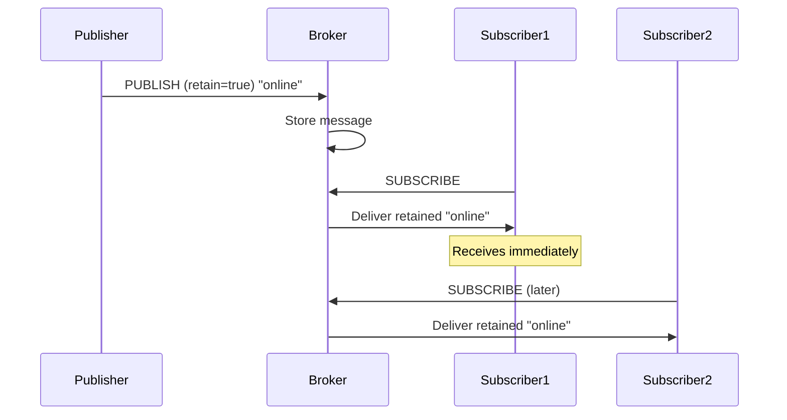

## Overview

Retained messages are a powerful MQTT feature that allows the broker to store the last message published to a topic and automatically deliver it to new subscribers. This ensures subscribers immediately receive the latest value without waiting for the next publish.

<Note>
Only **one retained message** is stored per topic. Publishing a new retained message overwrites the previous one.
</Note>

## How Retained Messages Work



### Key Characteristics

- **Persistence**: Retained messages persist on the broker until replaced or cleared
- **Immediate delivery**: New subscribers receive retained messages instantly
- **One per topic**: Each topic stores at most one retained message
- **Flag indication**: Subscribers can detect retained messages via the retain flag
- **QoS preserved**: Retained messages maintain their QoS level

## Publishing Retained Messages

### Python Examples

<CodeGroup>
```python Basic Retained Message
import paho.mqtt.client as mqtt

client = mqtt.Client("retained_publisher")
client.connect("localhost", 1883)

# Publish with retain flag
client.publish(
    "devices/device001/status",
    "online",
    qos=1,
    retain=True  # Enable message retention
)

print("Retained message published")
client.disconnect()
```

```python Device Status Monitor
import paho.mqtt.client as mqtt
import time
import json

def publish_device_status(client, device_id, status):
    """Publish device status as retained message"""
    topic = f"devices/{device_id}/status"
    payload = json.dumps({
        "status": status,
        "timestamp": time.time(),
        "device_id": device_id
    })
    
    client.publish(topic, payload, qos=1, retain=True)
    print(f"Device {device_id} status: {status}")

client = mqtt.Client("device_monitor")
client.connect("localhost", 1883)
client.loop_start()

# Publish online status
publish_device_status(client, "sensor001", "online")
publish_device_status(client, "sensor002", "online")

time.sleep(1)
client.loop_stop()
client.disconnect()
```

```python Configuration Publisher
import paho.mqtt.client as mqtt
import json

def publish_config(client, config_name, config_data):
    """Publish configuration as retained message"""
    topic = f"config/{config_name}"
    payload = json.dumps(config_data, indent=2)
    
    result = client.publish(
        topic,
        payload,
        qos=2,  # Use QoS 2 for critical config
        retain=True
    )
    result.wait_for_publish()
    print(f"Configuration '{config_name}' published and retained")

client = mqtt.Client("config_manager")
client.connect("localhost", 1883)
client.loop_start()

# Publish system configuration
config = {
    "max_temp": 30,
    "min_temp": 15,
    "alert_email": "admin@example.com",
    "check_interval": 60
}

publish_config(client, "temperature_monitor", config)

client.loop_stop()
client.disconnect()
```
</CodeGroup>

### JavaScript Examples

<CodeGroup>
```javascript Simple Retained Publish
const mqtt = require('mqtt');
const client = mqtt.connect('mqtt://localhost:1883');

client.on('connect', () => {
  // Publish retained message
  client.publish(
    'home/livingroom/temperature',
    '22.5',
    { qos: 1, retain: true },
    (err) => {
      if (!err) {
        console.log('Retained message published');
      }
      client.end();
    }
  );
});
```

```javascript Last Will with Retained
const mqtt = require('mqtt');

const client = mqtt.connect('mqtt://localhost:1883', {
  clientId: 'critical_device',
  will: {
    topic: 'devices/critical_device/status',
    payload: 'offline',
    qos: 1,
    retain: true  // Retain last will message
  }
});

client.on('connect', () => {
  // Publish online status (retained)
  client.publish(
    'devices/critical_device/status',
    'online',
    { qos: 1, retain: true }
  );
  
  console.log('Device online, retained status published');
});
```

```javascript Periodic State Updates
const mqtt = require('mqtt');
const client = mqtt.connect('mqtt://localhost:1883');

client.on('connect', () => {
  console.log('Publishing periodic retained states');
  
  setInterval(() => {
    const state = {
      timestamp: new Date().toISOString(),
      value: Math.random() * 100,
      unit: 'percent'
    };
    
    // Each publish overwrites previous retained message
    client.publish(
      'sensors/humidity/current',
      JSON.stringify(state),
      { qos: 1, retain: true }
    );
  }, 30000); // Every 30 seconds
});
```
</CodeGroup>

### Java Examples

<CodeGroup>
```java Basic Retained Publishing
import com.hivemq.client.mqtt.mqtt5.Mqtt5BlockingClient;
import com.hivemq.client.mqtt.mqtt5.Mqtt5Client;
import com.hivemq.client.mqtt.datatypes.MqttQos;

public class RetainedPublisher {
    public static void main(String[] args) {
        Mqtt5BlockingClient client = Mqtt5Client.builder()
                .identifier("retained_publisher")
                .serverHost("localhost")
                .buildBlocking();
        
        client.connect();
        
        // Publish with retain flag
        client.publishWith()
                .topic("devices/status")
                .payload("online".getBytes())
                .qos(MqttQos.AT_LEAST_ONCE)
                .retain(true)  // Enable retention
                .send();
        
        System.out.println("Retained message published");
        client.disconnect();
    }
}
```

```java Device State Manager
import com.hivemq.client.mqtt.mqtt5.Mqtt5AsyncClient;
import com.hivemq.client.mqtt.mqtt5.Mqtt5Client;
import com.hivemq.client.mqtt.datatypes.MqttQos;
import java.nio.charset.StandardCharsets;

public class DeviceStateManager {
    private final Mqtt5AsyncClient client;
    
    public DeviceStateManager() {
        this.client = Mqtt5Client.builder()
                .identifier("state_manager")
                .serverHost("localhost")
                .buildAsync();
    }
    
    public void publishState(String deviceId, String state) {
        String topic = "devices/" + deviceId + "/state";
        
        client.publishWith()
                .topic(topic)
                .payload(state.getBytes(StandardCharsets.UTF_8))
                .qos(MqttQos.EXACTLY_ONCE)
                .retain(true)
                .send()
                .whenComplete((publishResult, throwable) -> {
                    if (throwable != null) {
                        System.err.println("Failed to publish state: " + throwable.getMessage());
                    } else {
                        System.out.println("State published and retained: " + state);
                    }
                });
    }
    
    public static void main(String[] args) {
        DeviceStateManager manager = new DeviceStateManager();
        
        manager.client.connect()
                .thenRun(() -> {
                    manager.publishState("sensor001", "active");
                    manager.publishState("sensor002", "standby");
                });
    }
}
```
</CodeGroup>

## Receiving Retained Messages

### Detecting Retained Messages

<CodeGroup>
```python Python Subscriber
import paho.mqtt.client as mqtt

def on_connect(client, userdata, flags, rc):
    print("Connected, subscribing to topics")
    client.subscribe("devices/+/status", qos=1)

def on_message(client, userdata, msg):
    # Check if message is retained
    if msg.retain:
        print(f"[RETAINED] {msg.topic}: {msg.payload.decode()}")
    else:
        print(f"[LIVE] {msg.topic}: {msg.payload.decode()}")

client = mqtt.Client("retained_subscriber")
client.on_connect = on_connect
client.on_message = on_message

client.connect("localhost", 1883)
client.loop_forever()
```

```javascript JavaScript Subscriber
const mqtt = require('mqtt');
const client = mqtt.connect('mqtt://localhost:1883');

client.on('connect', () => {
  client.subscribe('devices/+/status', { qos: 1 });
  console.log('Subscribed to device status topics');
});

client.on('message', (topic, payload, packet) => {
  const message = payload.toString();
  
  if (packet.retain) {
    console.log(`[RETAINED] ${topic}: ${message}`);
    // Process as initial state
  } else {
    console.log(`[LIVE] ${topic}: ${message}`);
    // Process as real-time update
  }
});
```

```java Java Subscriber
import com.hivemq.client.mqtt.mqtt5.Mqtt5AsyncClient;
import com.hivemq.client.mqtt.mqtt5.Mqtt5Client;
import com.hivemq.client.mqtt.datatypes.MqttQos;

public class RetainedSubscriber {
    public static void main(String[] args) {
        Mqtt5AsyncClient client = Mqtt5Client.builder()
                .identifier("retained_subscriber")
                .serverHost("localhost")
                .buildAsync();
        
        client.connect()
                .thenCompose(connAck ->
                    client.subscribeWith()
                            .topicFilter("devices/+/status")
                            .qos(MqttQos.AT_LEAST_ONCE)
                            .callback(publish -> {
                                String topic = publish.getTopic().toString();
                                String payload = new String(publish.getPayloadAsBytes());
                                
                                if (publish.isRetain()) {
                                    System.out.println("[RETAINED] " + topic + ": " + payload);
                                } else {
                                    System.out.println("[LIVE] " + topic + ": " + payload);
                                }
                            })
                            .send()
                );
    }
}
```
</CodeGroup>

## Clearing Retained Messages

To remove a retained message, publish an **empty payload** with the retain flag set.

<CodeGroup>
```python Clear Retained Message
import paho.mqtt.client as mqtt

client = mqtt.Client("clear_retained")
client.connect("localhost", 1883)

# Clear retained message by publishing empty payload
client.publish(
    "devices/device001/status",
    payload="",  # Empty payload
    qos=1,
    retain=True  # Retain flag must be true
)

print("Retained message cleared")
client.disconnect()
```

```javascript Clear Retained Messages
const mqtt = require('mqtt');
const client = mqtt.connect('mqtt://localhost:1883');

client.on('connect', () => {
  // Clear single retained message
  client.publish(
    'devices/device001/status',
    '',  // Empty string
    { qos: 1, retain: true },
    (err) => {
      console.log('Retained message cleared');
      client.end();
    }
  );
});
```

```bash Mosquitto CLI
# Clear retained message
mosquitto_pub -h localhost -t "devices/device001/status" -n -r

# -n = null (empty) message
# -r = retain flag
```
</CodeGroup>

### Bulk Clear Retained Messages

```python
import paho.mqtt.client as mqtt

retained_topics = []

def on_connect(client, userdata, flags, rc):
    # Subscribe to all topics to discover retained messages
    client.subscribe("#")

def on_message(client, userdata, msg):
    if msg.retain:
        retained_topics.append(msg.topic)
        print(f"Found retained message: {msg.topic}")

def clear_all_retained():
    client = mqtt.Client("bulk_clear")
    client.on_connect = on_connect
    client.on_message = on_message
    
    client.connect("localhost", 1883)
    client.loop_start()
    
    # Wait to collect all retained messages
    time.sleep(2)
    client.loop_stop()
    client.disconnect()
    
    # Clear each retained message
    client.connect("localhost", 1883)
    for topic in retained_topics:
        client.publish(topic, "", retain=True)
        print(f"Cleared: {topic}")
    
    client.disconnect()
    print(f"Cleared {len(retained_topics)} retained messages")

clear_all_retained()
```

## Common Use Cases

<Tabs>
  <Tab title="Device Status">
    Track online/offline status of devices:
    
    ```python
    # Device publishes status on connect
    client.publish("devices/sensor001/status", "online", retain=True)
    
    # Set Last Will Testament (LWT) to update on disconnect
    client.will_set("devices/sensor001/status", "offline", retain=True)
    
    # Monitoring dashboard always sees latest status
    ```
  </Tab>
  
  <Tab title="Configuration">
    Distribute configuration to devices:
    
    ```python
    # Publish configuration once
    config = json.dumps({"interval": 60, "threshold": 25})
    client.publish("config/sensors", config, qos=2, retain=True)
    
    # New devices get config immediately on subscribe
    # No need to republish for every new device
    ```
  </Tab>
  
  <Tab title="Last Known Value">
    Store last known sensor reading:
    
    ```python
    # Sensor publishes readings
    client.publish(
        "sensors/temperature/current",
        "22.5",
        qos=1,
        retain=True
    )
    
    # Dashboard shows last value immediately
    # Even if sensor hasn't published recently
    ```
  </Tab>
  
  <Tab title="System State">
    Track system operating modes:
    
    ```python
    # Publish system mode
    modes = ["NORMAL", "MAINTENANCE", "EMERGENCY"]
    current_mode = "NORMAL"
    
    client.publish(
        "system/mode",
        current_mode,
        qos=2,
        retain=True
    )
    
    # All components see current mode on startup
    ```
  </Tab>
</Tabs>

## Retained Messages with Last Will Testament

<CodeGroup>
```python LWT + Retained
import paho.mqtt.client as mqtt
import time

def on_connect(client, userdata, flags, rc):
    print("Connected, publishing online status")
    # Publish online status
    client.publish(
        "devices/sensor001/status",
        "online",
        qos=1,
        retain=True
    )

client = mqtt.Client("lwt_device")

# Set Last Will with retain flag
client.will_set(
    "devices/sensor001/status",
    payload="offline",
    qos=1,
    retain=True  # Retained LWT
)

client.on_connect = on_connect
client.connect("localhost", 1883)
client.loop_start()

# Simulate device operation
time.sleep(10)

# Ungraceful disconnect triggers LWT
# (In real scenario, this might be network failure)
client.disconnect()
```

```javascript Heartbeat with Retained LWT
const mqtt = require('mqtt');

const deviceId = 'sensor001';
const statusTopic = `devices/${deviceId}/status`;

const client = mqtt.connect('mqtt://localhost:1883', {
  clientId: deviceId,
  will: {
    topic: statusTopic,
    payload: 'offline',
    qos: 1,
    retain: true
  }
});

client.on('connect', () => {
  // Publish online status
  client.publish(statusTopic, 'online', { qos: 1, retain: true });
  
  // Send periodic heartbeat
  setInterval(() => {
    client.publish(
      `devices/${deviceId}/heartbeat`,
      new Date().toISOString(),
      { qos: 0, retain: false }  // Don't retain heartbeat
    );
  }, 30000);
});
```
</CodeGroup>

<Warning>
Always set retained LWT messages to properly track device status. Without retention, monitoring systems might miss offline events.
</Warning>

## Best Practices

<Tip>
**Do:**
- Use retained messages for state information
- Clear retained messages when no longer needed
- Set retained LWT for device status
- Use QoS 1 or 2 with retained messages for reliability
- Keep retained message payloads small

**Don't:**
- Retain high-frequency telemetry data
- Retain temporary or time-sensitive data
- Use retained messages for commands
- Forget to clear old retained messages
- Retain sensitive information without encryption
</Tip>

### Retention Policy Example

```python
import paho.mqtt.client as mqtt
import time
import json

class SmartRetentionPublisher:
    def __init__(self):
        self.client = mqtt.Client("smart_publisher")
        self.client.connect("localhost", 1883)
        self.client.loop_start()
    
    def publish_state(self, topic, value):
        """State should be retained"""
        self.client.publish(topic, value, qos=1, retain=True)
    
    def publish_event(self, topic, value):
        """Events should NOT be retained"""
        self.client.publish(topic, value, qos=1, retain=False)
    
    def publish_telemetry(self, topic, value):
        """Telemetry should NOT be retained (high frequency)"""
        self.client.publish(topic, value, qos=0, retain=False)

publisher = SmartRetentionPublisher()

# Good: Retain device status
publisher.publish_state("devices/d001/status", "online")

# Good: Don't retain events
publisher.publish_event("devices/d001/events/button_press", 
                        json.dumps({"timestamp": time.time()}))

# Good: Don't retain high-frequency data
publisher.publish_telemetry("sensors/temp", "22.5")
```

## Performance Considerations

### Memory Usage

```python
# Monitor retained message count
import paho.mqtt.client as mqtt

retained_count = 0

def on_message(client, userdata, msg):
    global retained_count
    if msg.retain:
        retained_count += 1

client = mqtt.Client()
client.on_message = on_message
client.connect("localhost", 1883)
client.subscribe("#")  # Subscribe to all topics
client.loop_start()

time.sleep(3)  # Wait to collect messages
print(f"Total retained messages: {retained_count}")
```

<Note>
HiveMQ Community Edition stores retained messages in memory. Large numbers of retained messages can impact broker performance.
</Note>

## Testing Retained Messages

```bash
# Terminal 1: Publish retained message
mosquitto_pub -h localhost -t "test/retained" -m "Hello Retained" -r -q 1

# Terminal 2: Subscribe and receive retained message immediately
mosquitto_sub -h localhost -t "test/retained" -v
# Output: test/retained Hello Retained

# Terminal 3: Subscribe later (still receives retained message)
mosquitto_sub -h localhost -t "test/retained" -v
# Output: test/retained Hello Retained

# Clear the retained message
mosquitto_pub -h localhost -t "test/retained" -n -r

# Terminal 4: New subscriber receives nothing
mosquitto_sub -h localhost -t "test/retained" -v
# (no output - retained message cleared)
```

## Next Steps

<CardGroup cols={2}>
  <Card title="Quality of Service" icon="shield" href="/mqtt/guides/quality-of-service">
    Understand QoS levels with retained messages
  </Card>
  <Card title="Last Will Testament" icon="heart-pulse" href="/mqtt/features">
    Implement graceful disconnection handling
  </Card>
</CardGroup>

## Related Resources

- [Publishing & Subscribing](/mqtt/guides/publishing-subscribing)
- [Session Persistence](/mqtt/features)
- [MQTT Best Practices](/mqtt/overview)