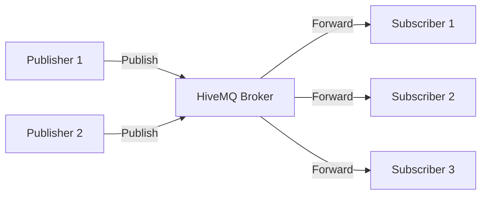

## What is MQTT?

MQTT (Message Queuing Telemetry Transport) is a lightweight, publish-subscribe messaging protocol designed for constrained devices and low-bandwidth, high-latency, or unreliable networks. It's ideal for Internet of Things (IoT), M2M (machine-to-machine), and mobile applications.

### Key Characteristics

<CardGroup cols={2}>
  <Card title="Lightweight" icon="feather">
    Minimal protocol overhead with small packet sizes, perfect for constrained devices and networks.
  </Card>
  <Card title="Publish-Subscribe" icon="share-nodes">
    Decoupled communication model where publishers and subscribers don't need to know about each other.
  </Card>
  <Card title="Quality of Service" icon="shield-check">
    Three QoS levels (0, 1, 2) to guarantee message delivery based on your needs.
  </Card>
  <Card title="Persistent Sessions" icon="database">
    Maintain connection state and queued messages even when clients disconnect.
  </Card>
</CardGroup>

## Publish-Subscribe Model

MQTT uses a broker-based architecture where clients connect to a central broker (HiveMQ CE) that routes messages between publishers and subscribers.



### Topics

Messages are published to named **topics** using a hierarchical structure with forward slashes as delimiters:

```
home/livingroom/temperature
home/bedroom/humidity
factory/machine1/status
factory/machine2/telemetry
```

### Wildcards

Subscribers can use wildcards to subscribe to multiple topics:

- **Single-level wildcard (`+`)**: Matches one level
  ```
  home/+/temperature  # Matches home/livingroom/temperature, home/bedroom/temperature
  ```

- **Multi-level wildcard (`#`)**: Matches multiple levels
  ```
  home/#  # Matches home/livingroom/temperature, home/bedroom/humidity, etc.
  ```

## HiveMQ CE MQTT Support

HiveMQ Community Edition provides complete implementation of MQTT protocols:

<Tabs>
  <Tab title="MQTT 3.1.1">
    Full support for MQTT 3.1.1, the most widely adopted version:
    
    - All QoS levels (0, 1, 2)
    - Retained messages
    - Last Will and Testament (LWT)
    - Clean/persistent sessions
    - Username/password authentication
    - TLS/SSL encryption
  </Tab>
  
  <Tab title="MQTT 5">
    Complete MQTT 5.0 support with enhanced features:
    
    - User properties (custom key-value metadata)
    - Reason codes and strings
    - Request/response pattern
    - Topic aliases
    - Shared subscriptions
    - Subscription identifiers
    - Message expiry interval
    - Server keep-alive
    - Enhanced authentication (SASL/challenge-response)
  </Tab>
</Tabs>

## Protocol Versions

| Version | Year | Status | Key Features |
|---------|------|--------|-------------|
| MQTT 3.1 | 2010 | Supported | Original standardized version |
| MQTT 3.1.1 | 2014 | Widely Used | Refinements and clarifications |
| MQTT 5.0 | 2019 | Latest | Enhanced features, better error handling |

<Note>
  HiveMQ CE automatically detects the MQTT version from the client's CONNECT packet and responds accordingly.
</Note>

## When to Use MQTT

MQTT is ideal for:

- **IoT Devices**: Sensors, actuators, smart home devices with limited resources
- **Mobile Applications**: Push notifications, location tracking, chat applications
- **Industrial IoT**: Factory automation, machine telemetry, SCADA systems
- **Smart Cities**: Traffic monitoring, environmental sensors, public transportation
- **Healthcare**: Patient monitoring, medical device connectivity
- **Automotive**: Telematics, vehicle-to-vehicle (V2V) communication

## MQTT vs Other Protocols

| Feature | MQTT | HTTP/REST | WebSocket |
|---------|------|-----------|----------|
| **Pattern** | Pub/Sub | Request/Response | Bidirectional |
| **Overhead** | Very Low | Medium | Low |
| **Real-time** | Excellent | Poor | Excellent |
| **QoS** | Built-in | Manual | Manual |
| **Bandwidth** | Minimal | Higher | Low |
| **Best For** | IoT, M2M | Web APIs | Web Real-time |

<Tip>
  HiveMQ CE supports MQTT over WebSocket, combining MQTT's efficiency with WebSocket's browser compatibility.
</Tip>

## Basic MQTT Workflow

<Steps>
  <Step title="Connect">
    Client establishes a connection to the MQTT broker (HiveMQ CE) using TCP, TLS, WebSocket, or Secure WebSocket.
    
    ```python
    import paho.mqtt.client as mqtt
    
    client = mqtt.Client()
    client.connect("broker.example.com", 1883, 60)
    ```
  </Step>
  
  <Step title="Subscribe">
    Client subscribes to one or more topics to receive messages.
    
    ```python
    client.subscribe("home/+/temperature")
    ```
  </Step>
  
  <Step title="Publish">
    Publisher sends messages to topics.
    
    ```python
    client.publish("home/livingroom/temperature", "22.5")
    ```
  </Step>
  
  <Step title="Receive">
    Subscribers receive messages from their subscribed topics.
    
    ```python
    def on_message(client, userdata, message):
        print(f"{message.topic}: {message.payload.decode()}")
    
    client.on_message = on_message
    ```
  </Step>
</Steps>

## Next Steps

<CardGroup cols={3}>
  <Card title="MQTT 3.1.1" icon="book" href="/mqtt/mqtt3">
    Learn about MQTT 3.1 and 3.1.1 features
  </Card>
  <Card title="MQTT 5" icon="star" href="/mqtt/mqtt5">
    Explore MQTT 5.0 enhancements
  </Card>
  <Card title="Transport Protocols" icon="network-wired" href="/mqtt/transports/tcp">
    Configure TCP, TLS, and WebSocket transports
  </Card>
  <Card title="Connecting Clients" icon="plug" href="/mqtt/guides/connecting-clients">
    Connect MQTT clients to HiveMQ CE
  </Card>
  <Card title="Pub/Sub Guide" icon="share-nodes" href="/mqtt/guides/publishing-subscribing">
    Learn publishing and subscribing patterns
  </Card>
  <Card title="Quality of Service" icon="shield" href="/mqtt/guides/quality-of-service">
    Understand QoS levels
  </Card>
</CardGroup>

## Additional Resources

- [MQTT Essentials](https://www.hivemq.com/mqtt-essentials/) - Comprehensive guide to MQTT
- [MQTT 5 Essentials](https://www.hivemq.com/mqtt-5/) - MQTT 5.0 feature guide
- [MQTT Specification](https://docs.oasis-open.org/mqtt/) - Official OASIS specifications